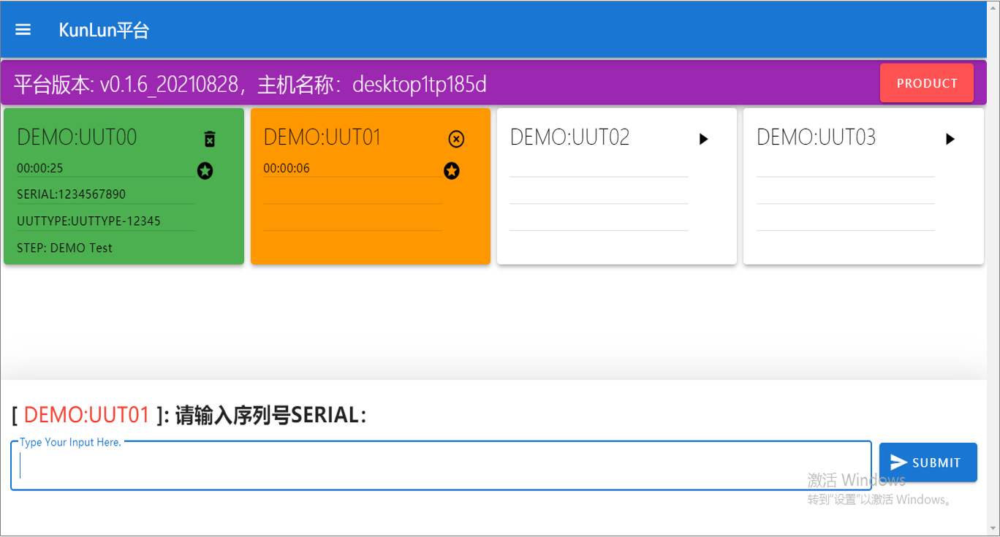

介绍
====
KunLun Auto Test是基于命令行的测试自动化平台。

平台的本质功能是：通过协议(SSH/TELNET/SERIAL等)连接待测产品(UUT)，发送命令行指令对产品进行激励，
并自动采集产品的反馈日志，用户根据测试业务需要对反馈的日志进行分析、判断，并决策下一个动作(继续发送或是停止测试), 
如此反复，直到所有的命令行指令发送完毕。

平台采用WEB形式的操作界面, 自动保存测试全流程日志, 同时提供丰富的接口函数，支撑用户快速二次开发。

测试主界面
-----------

上图展示的是 ``Container`` 工位界面。

平台采用三层结构表述测试环境架构，分别是：``Station(工站)->Container(工位)->Connection(连接)`` ，
一个工站可以包含多个工位，一个工位可以包含多个连接。

``Station工站`` 是指一个测试工序，一台物理测试主机可以配置若干个相同的或是不相同的测试工序，不同的测试工序完成不同的测试业务。

``Container工位`` 是指完成测试业务的具体执行单元(任务)，一个测试工序包含若干个测试工位，
多个测试工位可以并行执行多个测试任务，即同时测试多个产品。

``Connection(连接)`` 是指一个连接值待测产品(UUT)的 **物理连接** , 一个测试工位可以包含多个连接，以满足产品多元化测试的需求。
例如：手机测试中需要使用程控电源，综测仪，蓝牙连接模组，声音测试模组等，可以建立多个连接，连接之间相互配合、协同完成整个测试流程。

测试用例示例
--------------

通常一个测试用例包含：

1. 配置测试环境，连接产品
2. 发送一系列测试命令行
3. 对产品反馈的日志进行解析，判断测试结果是通过或是失败
4. 重复第2步与第3步
5. 关闭连接，清理测试环境

假设有如下测试用例：进入Python交互界面，通过 ``sys.platform`` 查询当前主机的操作系统类型，并打印结果，
若结果不为 ``win32``，测试失败。反之，测试通过::

    from libs import lib

    log = lib.get_event_logger()

    def main_sequencer():
        uut = lib.conn.UUT
        uut.open()
        uut.send("python\r", expect=">>>", timeout=10)
        uut.send("import sys\r", expect=">>>", timeout=10)
        uut.send("sys.platform\r", expect=">>>", timeout=10)
        log.debug(uut.buf)
        if "win32" not in uut.buf:
            raise Exception("platform should be [win32], go to fail")
        uut.send("exit()\r", expect=">", timeout=10)
        uut.close()
        return

以上为测试用例的代码实现，接下来先对代码进行分段解释。

1. 从平台导入接口函数库::

    from libs import lib

2. 实例化 ``事件日志``，获得实例log，后续可用 ``log.debug()`` ,  ``log.error()`` 等记录事件日志::

    log = lib.get_event_logger()

3. 定义入口函数，入口函数名必须是 ``main_sequencer`` , 平台将从接口函数开始调用用户的程序::

    def main_sequencer():

4. 获取预定义连接(如何预定义，参考 ``测试开发`` 章节)，协议为 ``DUMMY`` , 并打开此连接::

    uut = lib.conn.UUT
    uut.open()

平台支持多种连接协议，详情可以参考 **接口函数** 章节。

    1. ``DUMMY`` ：调用cmd.exe，获取windows的命令行界面。
    2. ``SSH`` ：根据提供的ip地址，用户名，密码，连接到产品。
    3. ``TELNET`` ：根据提供的ip地址，端口号，连接到产品。
    4. ``SERIAL`` ：根据提供的串口地址，波特率，连接到产品。

5. 发送命令行至连接，配置测试环境::

    uut.send("python\r", expect=">>>", timeout=10)
    uut.send("import sys\r", expect=">>>", timeout=10)

6. 发送测试命令行至连接，并采集产品反馈的日志，日志保存在 ``uut.buf`` 中，
``log.debug()`` 将日志打印至 **事件日志** 界面::

    uut.send("sys.platform\r", expect=">>>", timeout=10)
    log.debug(uut.buf)

7. 对产品反馈的日志进行分析，判断测试是否通过，若失败，触发异常，测试将停止::

        if "win32" not in uut.buf:
            raise Exception("platform should be [win32], go to fail")

需要说明的是，用户可以使用 ``raise`` 触发异常，也可以采用断言 ``assert`` 触发异常::

    assert "win32" in uut.buf, "platform should be [win32], go to fail"

8. 清理测试环境，并关闭连接::

        uut.send("exit()\r", expect=">", timeout=10)
        uut.close()

