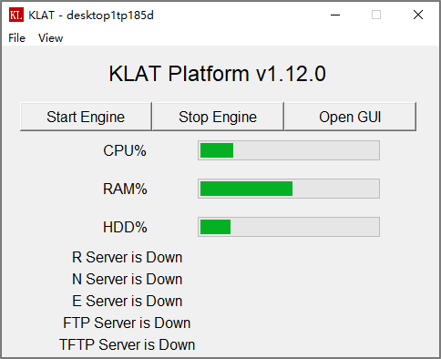
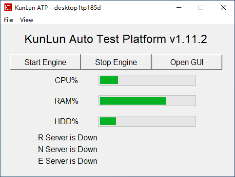

安装指南
========

操作系统要求
-------------
平台要求安装在Windows 10操作系统。暂不支持Linux操作系统。

安装包下载
-------------
请从以下地址下载最新安装包:

https://gitee.com/robinwu0607/kunlun-atp/releases

安装过程说明
-------------
下载安装包，右键以管理员权限安装，安装过程如以下所示：

.. image:: ../_static/安装指南/setup1.png

安装目录必须为: ``C:\Program Files (x86)\KunLun ATP`` ，不要修改默认设置。

.. image:: ../_static/安装指南/setup2.png

选择创建桌面快捷方式。

.. image:: ../_static/安装指南/setup3.png
.. image:: ../_static/安装指南/setup4.png
.. image:: ../_static/安装指南/setup5.png

选择启动应用程序，点击Finish按钮，按照完成。

.. image:: ../_static/安装指南/setup6.png

安装完成后，平台将在桌面自动创建快捷方式，方便快速启用平台管理面板。

平台管理面板
------------
双击桌面快捷方式，打开平台管理面板。

当平台启动后，管理平台面板将监控服务的运行状态。

管理面板的功能说明如下：

1. 点击 ``Start Engine`` 按钮，启动平台服务。启动过程中，若出现请求权限的弹窗，需选择 ``允许`` 或是 ``同意`` 。
当 ``R Server`` , ``N Server`` 与 ``E Server`` 的状态都为 **running** 时，平台服务成功启动。

需要说明的是，只有当用户配置了 ``FTP服务`` 或是 ``TFTP服务`` 时, ``FTP Server`` 与 ``TFTP Server`` 才会启动。

2. 点击 ``Stop Engine`` 按钮，关闭平台所有服务，当所有Server的状态都为 **down** 时，平台服务成功停止。

3. 点击 ``Open GUI`` 按钮，将自动打开浏览器，并导航至 ``https://localhost`` 地址。
平台要求测试主机使用 ``Google Chrome`` 浏览器（88版本或以上）或者是 ``Edge`` 浏览器。

4. 点击菜单栏 ``File``，选择 ``Exit`` 后可以退出管理界面。

5. 点击菜单栏 ``View``，选择 ``KL Event`` 后可以查看平台加载 ``hostname.py`` 时产生的事件错误日志。
