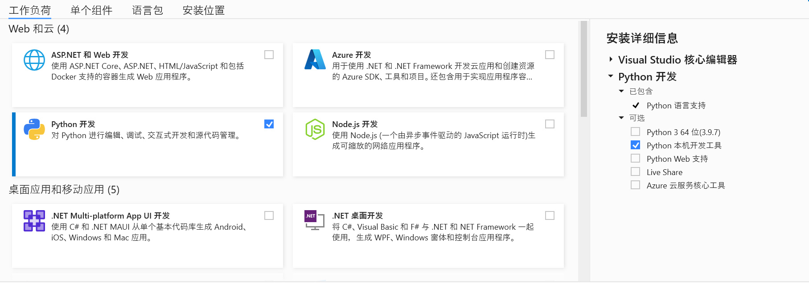

安装指南
========

操作系统要求
-------------
KunLun AutoTest暂支持以下操作系统
1. Win10
2. Ubuntu 18.04+

安装包下载
-------------

请从以下地址下载最新pip安装包, 安装包名以 ``tar.gz`` 结尾:

https://gitee.com/robinwu0607/kunlun-atp/releases

Python版本要求
----------------
KunLun AutoTest要求Python版本为 ``3.7``.

安装方法
-------------

安装 Visual Studio
^^^^^^^^^^^^^^^^^^^^^^

可以从以下地址下载最新版本 Visual Studio Installer.

``https://learn.microsoft.com/zh-cn/visualstudio/install/install-visual-studio?view=vs-2022``

选择工作负载 -> Python开发 -> Python本机开发工具, 然后点击安装即可.

安装 KunLun AutoTest
^^^^^^^^^^^^^^^^^^^^^^^^^

请将 ``pip`` 工具先行升级到最新版本, 再安装KunLun AutoTest, 否则可能遇到依赖包 ``cryptography`` 安装失败的问题.

使用 ``pip install kunlun-xx.xx.xx.tar.gz`` 即可, ``pip`` 工具会自动安装相关依赖.

需要说明的是: 建议创建虚拟环境virtual environment后, 再安装KunLun AutoTest, 虚拟环境的安装方法, 这里就不再赘述.

安装完成后, 命令行工具 ``kunlun`` 即为可用状态， 其相关用法介绍如下:: 

  Usage: kunlun [start|stop|web|info]

  - start   Start KunLun AutoTest Service.
  - stop    Stop KunLun AutoTest Service.
  - web     Open KunLun AutoTest WebPage.
  - info    Show KunLun Autotest Service Status.
