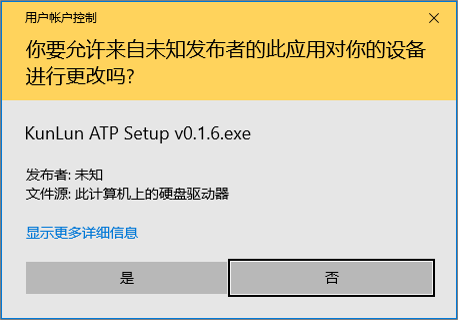
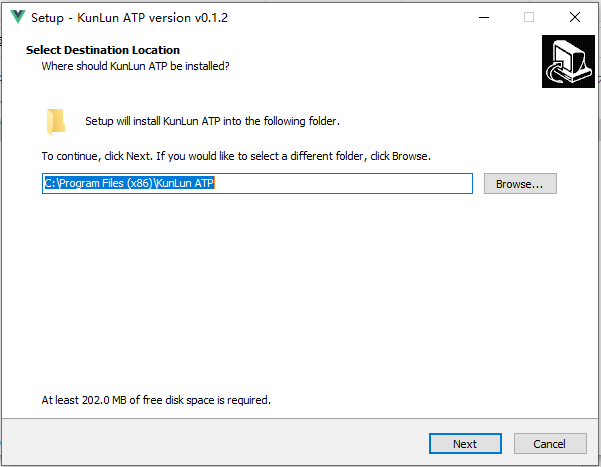
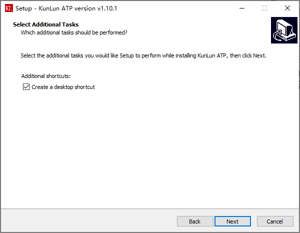
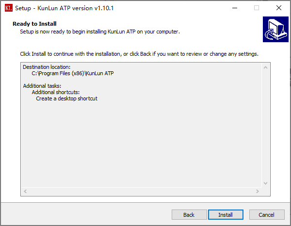
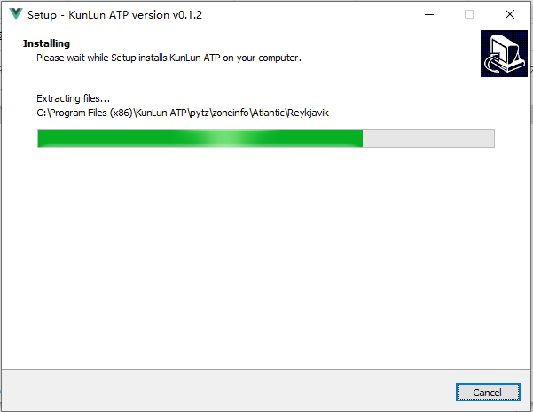
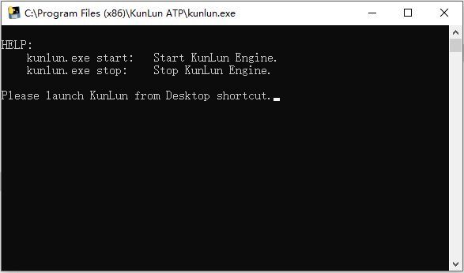
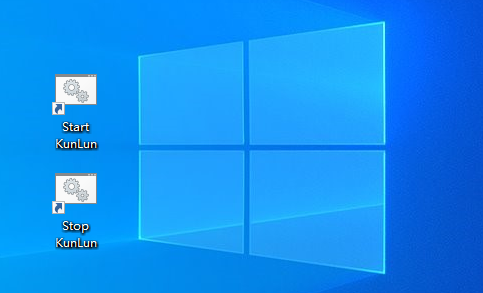
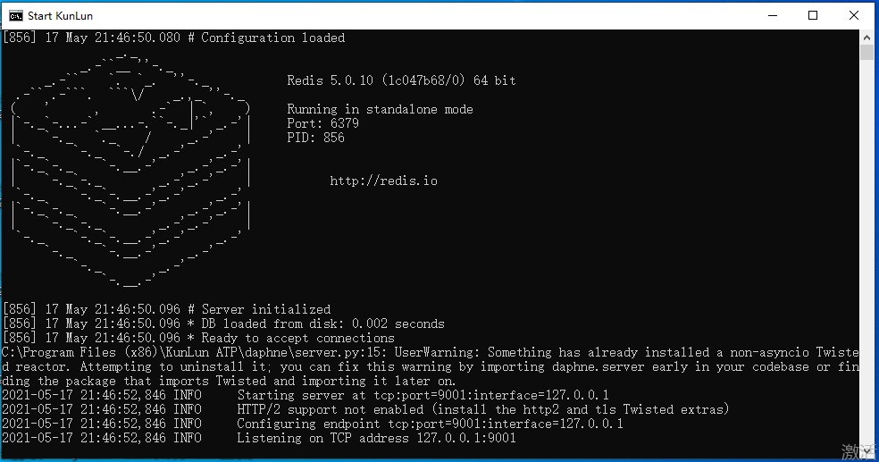
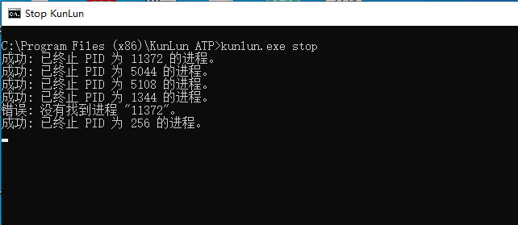

安装指南
========

操作系统要求
-------------
本平台推荐安装在Windows 10操作系统。未来将支持Linux操作系统。

安装包下载
-------------
请从以下地址下载最新安装包:

https://gitee.com/robinwu0607/kunlun-atp/releases

安装过程说明
-------------
下载安装包，右键以管理员权限安装，安装过程如以下所示：

安装目录必须为："C:\Program Files (x86)\KunLun ATP"，不要修改默认设置。

选择创建桌面快捷方式。

点击Finish，安装完成。

.. image:: ../_static/安装指南/setup6.png

软件启动/关闭
-------------

安装完成后，本平台将在桌面自动创建快捷方式，以便快速启动/关闭本平台服务。

双击Start Kunlun快捷方式，启动平台的过程中，如果出现请求权限的弹窗，需选择"允许"或是"同意"。
本平台服务运行过程中，不能关闭此窗口，若不小心关闭，需重新启动。

双击Stop Kunlun快捷方式，关闭本平台所有服务，

