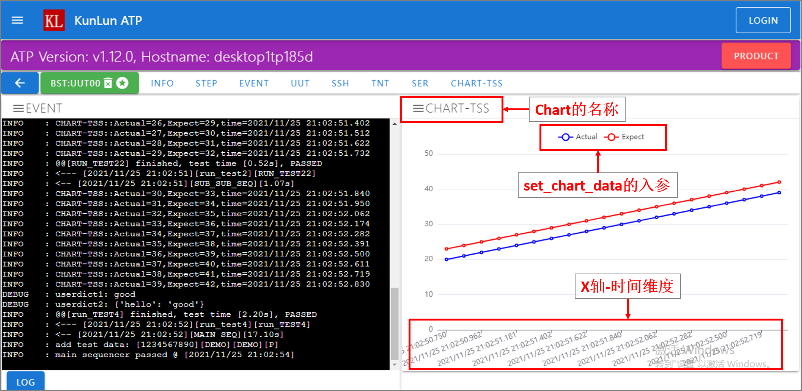

接口函数
========

lib.ud
-------
``lib.ud`` 是一个全局字典userdict，可以在测试代码的任意位置使用。

典型应用场景： 用户定义多个函数，函数间的变量传递就会变得复杂，使用 ``lib.ud`` 可以轻松解决这个问题。

``lib.ud`` 使用起来也很方便，如下所示:

* ``lib.ud.test_spec = 123`` : 设置 ``test_spec`` 值为 ``123`` 。

* ``spec = lib.ud.test_spec`` 获取 ``test_spec`` 的值，并保存在变量 ``spec`` 。

需要说明的是：``lib.ud`` 支持任意级层的赋值，如 ``lib.ud.test.ft.result.name = "PASS"`` 。

lib.conn
---------
``lib.conn`` 是一个连接池，保存着用户在 ``hostname.py`` 中为当前 ``container工位`` 定义的所有连接。

例如:

* 用户定义了 ``add_connection(name="UUT")``，则使用 ``uut = lib.conn.UUT`` 可以获取此连接实例。
* 用户定义了 ``add_connection(name="REF")``，则使用 ``uut = lib.conn.REF`` 可以获取此连接实例。
* 用户定义了 ``add_connection(name="COM")``，则使用 ``uut = lib.conn.COM`` 可以获取此连接实例。

获取连接实例 ``uut`` 后，可以使用实例的以下几种属性:

1. ``uut.open()`` ：打开连接, 需要注意的是：每次 ``open()`` 前，会自动调用 ``close()`` 方法。
2. ``uut.close()`` ：关闭连接
3. ``uut.send()`` : 向连接传递命令行.
4. ``uut.buf`` ：保存 *uut.send()* 语句发送后，产品回馈的日志。
5. ``uut.phrase`` ：保存 *uut.send()* 语句发送后，收到的 ``expect`` 字符串。
6. ``uut.capture()`` ：对 ``uut.buf`` 进行解析，获取想要的字符串片段。

需要强调的是：``uut.send()`` 是传递命令行至待测产品UUT的唯一方式，使用方法如下::

    uut.send("python\r", expect=">>>", timeout=10)

对此语句的解释：通过 ``uut.send`` 发送命令行 ``python`` ，并带回车符 ``\r`` ，并期望在 ``timeout`` 的 ``10`` 秒钟内，收到字符串 ``>>>`` 。
若收到，此语句正常完成，产品反馈的日志将以字符串形式保存在 ``uut.buf`` 中，然后执行下一条语句。
若未收到字符串 ``>>>``，则触发异常(用户可以使用 ``try...except...`` 捕获此异常)。

需要说明的是：

* ``uut.send()`` 的 ``expect`` 可以接受 ``列表list``， 若 ``expect`` 为 ``列表`` ，当平台收到 ``列表`` 中的任意一元素时，``uut.send()`` 语句执行完成，收到的元素保存在 ``uut.phrase`` ::

    uut.send("dir\r", expect=[">", "#", "$"], timeout=60)
    log.debug(uut.phrase)
    if uut.phrase in [">", "#"]:
        pass
    if uut.phrase in ["$"]:
        raise Exception("Got '$', go to fail")

* ``uut.send()`` 前会自动清空 ``uut.buf`` 内容,  ``uut.send()`` 完成后，收到的所有字符会自动保存在 ``uut.buf`` 。此例中 ``uut.send()`` 完成后，若使用 ``log.debug(uut.buf)`` ，将在事件日志窗口打印出如下字符::

    python
    Python 3.7.8 (tags/v3.7.8:4b47a5b6ba, Jun 28 2020, 08:53:46) [MSC v.1916 64 bit (AMD64)] on win32
    Type "help", "copyright", "credits" or "license" for more information.
    >>>

* ``uut.capture`` 可以快速截取 ``uut.buf`` 中用户想要的字符串，并支持 ``正则表达``，其用法如下::

    # 语法说明
    user_string = uut.capture(start_string, end_string="\n")
    # 例如：想要获取Python的版本(此例中，版本为：3.7.8 )
    version = uut.capture("Python", "(tags")

lib.ask_question()
--------------------
``lib.ask_question()`` 提供一种用户交互方法，调用此接口函数后，网页界面将弹出对话框，用户可以在对话框应答一个问题，并返回答案(字符串).

典型应用场景：弹出对话框，要求用户输入产品的序列号::

    ans = lib.ask_question("请输入序列号SERIAL：", timeout=60 * 3)

答案会保存在 ``ans`` 中。

需要说明的是：``lib.ask_question()`` 支持传入如下参数:

1. ``options`` : 备选答案，是一个列表，例如 ``["12345", "678990"]``。若传入，则网页会弹出一个 ``单项选择题`` 对话框，若不设置，则弹出一个 ``填空题`` 对话框。
2. ``image`` : 问题描述图片，是一个字符串，例如 ``"project\bee.jpg"``。若传入，则弹出的对话框会展示图片信息。
3. ``visible`` : 输入内容可视，默认为 ``True``。若设置为 ``False``, 则用户输入内容显示为 ``*`` 号，常用于密码输入等场景。
4. ``multiple`` : 多选题, 默认为 ``False``。若设置为 ``True``, 则网页弹出一个 ``多项选择题``。当 ``options`` 未设置时，``multiple`` 无效。
5. ``privilege`` : 插队，默认为 ``False``。多 ``Container工位`` 提问，遵循 ``FIFO先进先出`` 原则。若设置为 ``True``，将插队至队列的第一位。
6. ``timeout`` : 超时，默认为 ``3600`` 秒。若在超时时间内，用户未响应问题，则触发异常。

lib.ask_questions()
---------------------
此接口函数提供一个用户交互方法，调用此函数后，网页界面将弹出对话框，用户可以在对话框同时应答多个问题，并返回答案(列表).

使用示例：弹出对话框，要求应答多个问题::

    ans = lib.ask_questions(["请输入序列号SERIAL：", "请输入UUTTYPE：", "请输入员工工号："], timeout=60 * 3)

答案将保存在 ``ans`` 中。

需要说明的是：``lib.ask_questio()`` 支持传入如下参数:

1. ``image`` : 问题描述图片，是一个字符串，例如 ``"project\bee.jpg"``。若传入，则弹出的对话框会展示图片信息。
2. ``privilege`` : 插队，默认为 ``False``。多 ``Container工位`` 提问，遵循 ``FIFO先进先出`` 原则。若设置为 ``True``，将插队至队列的第一位。
3. ``timeout`` : 超时，默认为 ``3600`` 秒。若在超时时间内，用户未响应问题，则触发异常。

需要强调的是: ``lib.ask_questions()`` 与 ``lib.ask_question()`` 共享同一个 ``FIFO队列`` 。

lib.set_display1/2/3()
-----------------------
``lib.set_display1/2/3()`` 可以设置 ``Container工位`` 面板 ``定制区域`` 的显示，display1/2/3分别面板的上/中/下位置。
建议的定制方案为::

    # display1 显示产品的序列号
    lib.set_display1("SERNUM: 12345678")
    # display2 显示产品的类型
    lib.set_display2("UUTTYPE: 34-5678-09")
    # display3 显示当前的测试项目名称
    lib.set_display3("STEP: RUN TEST")

lib.set_test_name()
--------------------
``lib.set_test_name()`` 设置当前测试项目名称, 若测试项FAIL, 测试记录会自动用此名称作为测试失败项, PASS则不记录。
使用示例::

    lib.set_test_name("run cpu test")

lib.get_container_name()
--------------------------
``lib.get_container_name()`` 返回当前的测试工位名称。
使用示例：在 ``FT:UUT00`` 上点击开始测试，返回值为字符串 ``FT:UUT00`` ::

    container_name = lib.get_container_name()

lib.add_test_data()
----------------------
``lib.add_test_data()`` 可以为产品做测试记录。

测试过程中，使用此接口函数记录产品信息，测试完成后，根据测试结果成功或是失败，自动记录一笔 ``P`` （Pass）或是 ``F`` （Fail）::

    lib.add_test_data(sernum=serial, uuttype=uuttype, area="FT")

需要强调的是：此接口函数至少需要传入3个参数，它们是： ``sernum`` 产品条码,  ``uuttype`` 产品类型,  ``area`` 测试工序名称。

需要说明的是：此接口函数还支持传入更多参数，以便帮助用户记录更多信息，它们是：

* ``label1, label2, label3, label4, label5``
* ``version1, version1, version3, version4, version5``
* ``str1, str2, str3, str4, str5, str6``

lib.get_mode()
---------------
``lib.get_mode()`` 返回当前测试的模式，值为 ``PRODUCT`` 或是 ``DEVELOP`` ::

    mode = lib.get_mode()

lib.get_params()
-----------------------
``lib.get_params()`` 返回 ``hostname.py`` 中当前工站的 ``add_params_data()`` 的值，是一个字典。
例: 如设置 ``params=dict(host="192.168.1.1", port=2003)``，则返回值为 ``{"host": "192.168.1.1", "port": 2003}`` 。

lib.get_project_name()
-----------------------
``lib.get_project_name()`` 返回 ``hostname.py`` 中相应工站的 ``sequencer`` 的第一个值(以 **.** 点号分开)，是一个字符串。
例: 如设置 ``sequencer="demo.main"``, 则返回值为 ``demo`` 。

lib.get_sequencer_definition()
------------------------------
返回 ``sequencer`` 实例，用此实例编排测试序列，测试过程中，可以在 **调试界面** 的 ``STEP`` 窗口查看测试序列流程图。
假设测试代码中定义有如下函数::

    def run_test():
        log.debug("welcome to main sequencer")
        container_name = lib.get_container_name()
        log.debug(container_name)
        return

    def run_test1(name):
        uut = lib.get_uut(protocol="DUMMY")
        uut.open()  # open the connection
        log.debug("run test1: dir, name: {}".format(name)
        uut.send("dir\r", expect=">", timeout=10)
        time.sleep(1)
        return

    def run_test2():
        uut = lib.conn.UUT
        log.debug("run test2: cd")
        uut.send("cd\r", expect=">", timeout=10)
        return

    def run_test3():
        lib.add_test_data(sernum="1234567890", uuttype="DEMO", area="DEMO")
        log.debug("run test3: finalize set True.")
        return

``sequencer`` 的基本使用示例::

    def main_sequencer():
        seq = lib.get_sequencer_definition("SEQ")
        seq.add_step(run_test, name="RUN TEST")
        seq.add_step(run_test1, name="RUN TEST1", kwargs={"name": "gps test"})
        seq.add_step(run_test2, name="RUN TEST2")
        seq.add_step(run_test3, name="RUN TEST3")
        return seq

注意：``add_step()`` 后要跟函数或方法的名字，``免小括号()``。

``sequencer`` 形式的代码编排，为测试策略的实施提供了便利，以下是当前支持的策略，更多策略持续增加中。

1. 通过设置 ``in_parallel=True`` 可以实施 **平行测试** 策略。

使用示例::

    def main_sequencer():
        seq = lib.get_sequencer_definition()
        seq.add_step(run_test, name="RUN TEST")
        seq.add_step(run_test1, name="RUN TEST1", in_parallel=True)
        seq1 = seq.add_sequencer("SUB SEQUENCER")
        seq1.add_step(run_test2, name="RUN TEST2")
        seq1.add_step(run_test3, name="RUN TEST3")
        seq1.add_step(run_test4, name="RUN TEST4")
        return seq

2. 通过设置 ``continue_on_error=True`` 可以实施 **测试失败不中断** 策略，最终测试仍以失败结束。
若有多个step被施加此策略，最终测试失败项自动选择第一个失败的step。

使用示例::

    # re-define run_test2() function.
    def run_test2():
        uut = lib.conn.UUT
        log.debug("run test2: cd")
        uut.send("cd\r", expect=">", timeout=10)
        raise Exception("run test2 failed")

    def main_sequencer():
        seq = lib.get_sequencer_definition("SEQ")
        seq.add_step(run_test, name="RUN TEST")
        seq.add_step(run_test1, name="RUN TEST1")
        seq.add_step(run_test2, name="RUN TEST2", continue_on_error=True)
        seq.add_step(run_test3, name="RUN TEST3")
        return seq

3. 通过设置 ``finalize=True`` 可以实施 **测试失败后清理** 策略。若 ``run_test2`` 测试失败，会自动运行最后一个step，即 ``run_test3``。
若最后一个step测试失败，则不会再次运行最后一个step。

使用示例::

    def main_sequencer():
        seq = lib.get_sequencer_definition("SEQ", finalize=True)
        seq.add_step(run_test, name="RUN TEST")
        seq.add_step(run_test1, name="RUN TEST1")
        seq.add_step(run_test2, name="RUN TEST2")
        seq.add_step(run_test3, name="RUN TEST3")
        return seq

4. 通过设置 ``loop_on_error=3`` 可以实施 **测试失败后重测** 策略。若 ``run_test2`` 测试失败，会自动重测3次，其中任何一次pass，
此step为pass。

使用示例::

    def main_sequencer():
        seq = lib.get_sequencer_definition("SEQ", finalize=True)
        seq.add_step(run_test, name="RUN TEST")
        seq.add_step(run_test1, name="RUN TEST1")
        seq.add_step(run_test2, name="RUN TEST2", loop_on_error=3)
        seq.add_step(run_test3, name="RUN TEST3")
        return seq

注意：一个step可以实施单一策略，也可以实施组合策略。 优先级 ``loop_on_error`` > ``continue_on_error`` 。
``in_parallel`` 和 ``finalize`` 为独立策略，与其他策略无冲突。

lib.set_sequencer_data()
------------------------
为当前的step增加sequencer数据，sequencer数据可以通过 ``lib.get_sequencer_data()`` 获得。

例如在函数 ``run_test2()`` 中调用此接口函数::

    lib.set_sequencer_data(param1=1234, test=5434, value=2344)

**此接口函数正在重新设计，暂未启用**

lib.get_sequencer_data()
------------------------
获取sequencer数据，例如在函数 ``run_test3()`` 中调用此接口函数::

    lib.get_sequencer_data()

    # could get below sequencer data.
    [
        {'index': 1, 'name': 'RUN_TEST', 'result': 'PASS', 'time_cost': 0},
        {'index': 2, 'name': 'RUN_TEST1', 'result': 'PASS', 'time_cost': 4},
        {'index': 3, 'name': 'RUN_TEST2', 'result': 'FAIL', 'time_cost': 0, 'param1': 1234, 'test': 5434, 'value': '2344'},
        {'index': 4, 'name': 'RUN_TEST3', 'result': 'PASS', 'time_cost': 0}
    ]

lib.get_xlsx_params()
-----------------------
返回当前项目下的XLSX(Excel)文件中的值, XLSX的命名必须是 ``params.xlsx`` ,
如当前项目为 ``demo``, 则XLSX的路径为 ``demo/params.xlsx`` 。

其内容格式如下:

+---------+-----------+----------+
| name    | value     |    desc  |
+=========+===========+==========+
| param1  | 1234      |    demo  |
+---------+-----------+----------+
| param2  | 4567      |    test  |
+---------+-----------+----------+
| param3  | 8765      |    test2 |
+---------+-----------+----------+

使用示例:

假设XLSX当前的Sheet名为 ``Sheet1`` , 若要获取 ``param2`` 的值,
则调用 ``lib.get_xlsx_params("Sheet1", "param2")``， 即返回字符串 ``4567`` 。

使用 ``lib.get_xlsx_params("Sheet1", "param*")``，返回所有以 ``param`` **起始** 的参数，以字典形式返回。

使用 ``lib.get_xlsx_params("Sheet1", "*param")``，返回所有以 ``param`` **结尾** 的参数，以字典形式返回。

使用 ``lib.get_xlsx_params("Sheet1", "*")``，返回 **所有** 参数，以字典形式返回。

lib.xlsx_measure()
-----------------------
通过XLSX(Excel)文件定义指标数据(指标上限与指标下线), 在接口函数中带入 **实际测量值** , 可自动进行指标检查。 XLSX的命名必须是 ``meas.xlsx`` ,
如当前项目为 ``demo``, 则XLSX的路径为 ``demo/meas.xlsx`` 。

其内容格式如下:

+---------+----------+-----------+-----------+
| name    | lower    |   upper   |    desc   |
+=========+==========+===========+===========+
| meas1   | 20       |    50     |    rf     |
+---------+----------+-----------+-----------+
| meas2   | 40       |    78.9   |    gps    |
+---------+----------+-----------+-----------+
| meas3   | -35      |    35.9   |    ground |
+---------+----------+-----------+-----------+

使用示例:

假设XLSX当前的Sheet名为 ``Sheet1`` , 待检查的指标名为 ``meas1`` , 实际测量值为 ``30`` 。
调用 ``lib.xlsx_measure("Sheet1", "meas1", 30)``,  XLSX文件中 ``meas1`` 的lower(指标下限)为 ``20`` ,
upper(指标上限)为 ``50`` , 因为 ``20<=30<=50`` , 所以指标检查通过。

若实际测量值为 ``60`` ，则指标检查失败，将触发异常，测试失败。

lib.start_container_test()
---------------------------
使用一个 ``container`` 启动其他 ``container`` 测试。

使用示例：

使用 ``lib.start_container_test("DEMO:UUT01")`` 启动 ``DEMO:UUT01`` 测试。

使用 ``lib.start_container_test(["DEMO:UUT01", "DEMO:UUT02"])`` 连续启动多个 ``container`` 测试。

lib.get_allocation()
----------------------
在 ``hostname.py`` 中调用此接口函数，可以更精细化定制用户界面。

使用示例::

    from libs import lib

    def main():
        kl = lib.get_allocation()
        station = kl.add_station("BST", "功能测试", recycle=False, photo=r"project\bee.jpg")
        station.add_sequencer("project.sequence")
        station.add_params_data(host="192.168.0.1")
        for i in range(4):
            container = station.add_container("UUT{:02d}".format(i))
            container.add_params_data(ip="192.168.1.{}".format(i), test="hello world")
            container.add_connection(name="UUT", protocol="DUMMY")
            container.add_connection(name="REF", protocol="TELNET", host="localhost", port=23)
        station = kl.add_station("BP2", "FT测试", recycle=False)
        station.add_sequencer("project.sequence")
        station.add_params_data(host="192.168.0.1")
        for i in range(4):
            container = station.add_container("UUT{:02d}".format(i))
            container.add_connection(name="UUT", protocol="DUMMY")
            container.add_connection(name="PWR", protocol="SSH", host="192.168.0.2", username="root", password="root")

lib.set_chart_data()
---------------------
``lib.set_chart_data()`` 将数据传到用户界面，制作线图(Line Chart).

使用步骤：

1. 在 ``hostname.py`` 中增加 ``chart`` 窗口, 设置入参 ``name``，例如 ``name="TSS"`` ::

    container.add_line_chart(name="TSS")

2. 重启平台服务，使修改后的 ``hostname.py`` 生效。
3. 打开用户界面，导航至 ``Container连接`` 页面，可以看到 ``CHART-TSS`` 窗口。
4. 用户代码中调用接口函数，入参 ``name="TSS"`` 不参与制图，其他入参会参与制图::

    lib.set_chart_data(name="TSS", Actual=20, Expect=23)

5. 用户界面会根据 ``lib.set_chart_data()`` 的入参 ``name`` 选择对应的窗口，其他入参作为 ``chart`` 的输入开始制图。

