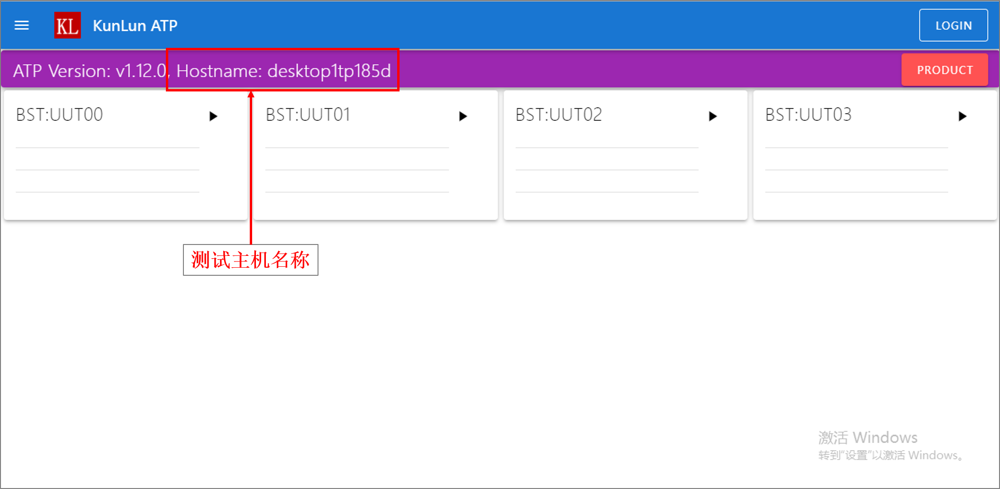
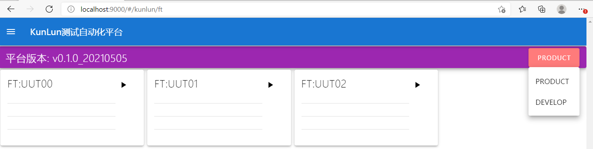
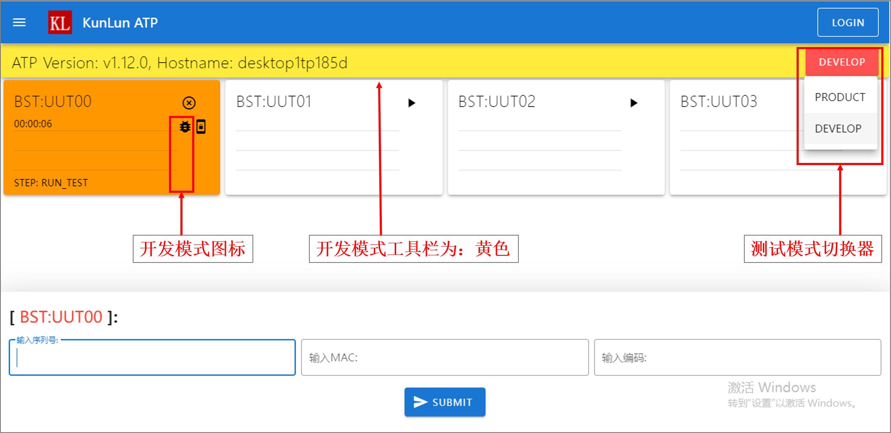

测试开发
========

kunlun-data文件夹
-------------------
首次安装，启动本平台软件，会自动创建 ``D:\kunlun-data`` 文件夹，
并在文件夹内创建数据库 ``db.sqlite3`` ，以及文件夹 ``product`` , ``develop`` 与 ``logs`` .

1. ``db.sqlite3`` ：数据库文件，保存测试记录。
2. ``logs`` ：测试日志文件夹，保存测试过程中产生的测试日志，以及保存一些临时文件。
3. ``product`` ：生产模式将调用此文件夹下的代码。
4. ``develop`` : 开发模式将调用此文件夹下的代码。

其中, ``product`` 文件夹中包含两个DEMO子文件夹，它们是：

1. ``project`` : DEMO演示项目，其中的 ``main.py`` 中提供DEMO代码。
2. ``hostname`` : 界面配置文件夹，提供接口配置界面上的测试工站/工位/连接的数量（DEMO场景下有约束）。

用户的代码，可以以项目的形式，保存在 ``product`` 目录下。项目必须包含 ``main.py`` 文件，平台执行任务时，
将自动调用 ``main.py`` 中的函数 ``main_sequencer()`` ，作为入口函数。

平台启动时，平台会自动调用 ``hostname`` 文件夹下，以 **主机名称** 命名的python文件(如： ``desktop123.py`` )，
标准的 **主机名称** 可以如下界面中获取。

``主机名称.py`` 文件的内容示例如下::

    GUI_CONFIG = [
        dict(name="DEMO", desc="仅用于演示", uut=1, sequencer="project.main", params=dict(host="192.168.0.100"))
    ]

``GUI_CONFIG`` 是一个列表，列表的每一个元素代表一个工站Station。示例中的

1. ``name`` 定义工站名字。
2. ``desc`` 对工站进行描述。
3. ``uut`` 代表工站下面的工位数量。
4. ``sequencer`` 定义此工站绑定的用户的代码。
5. ``params`` 定义此工站的硬件配置参数。

其中，DEMO中的 ``sequencer`` 把 **DEMO工站** 与 ``project.main`` 关联起来了，因此 **DEMO工站** 下执行
的测试任务，会自动调用 ``project`` 项目下的 ``main.py`` 文件中的 ``main_sequencer`` 函数。

开发者模式与生产模式
--------------------
在测试主界面，可以切换生产模式与开发模式，本平台后台将根据选择的模式，
自动调用 ``product`` 或是 ``develop`` 文件夹下测试代码。

**注意** : DEMO版本只有生产模式。