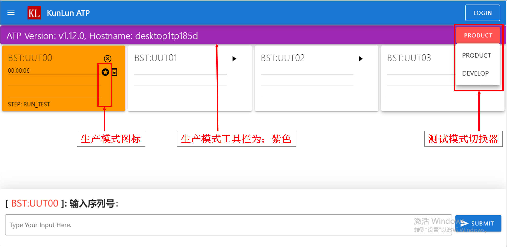

测试开发
========

kunlun-data文件夹
-------------------
首次安装，启动平台软件后，平台将自动创建 ``D:\kunlun-data`` 文件夹目录，
``D:\kunlun-data`` 目录包含以下文件或文件夹。

1. ``db.sqlite3`` ：数据库文件，保存测试记录。
2. ``logs`` ：测试日志文件夹，保存测试过程中产生的测试日志，以及保存一些临时文件。
3. ``product`` ：生产模式将调用此文件夹下的代码。
4. ``develop`` : 开发模式将调用此文件夹下的代码。
5. ``tftpboot`` : ``tftp`` 服务与 ``ftp`` 服务的根文件目录。
6. ``packages`` : 用户代码打包成 ``.zip`` 格式后的保存目录。
7. ``hostname.pem`` : 用户主机的唯一ID，用来制作license，例如 ``desktop1tp185d.pem`` 。

其中，``product`` 文件夹中包含两个子文件夹，它们是：

1. ``project`` : 演示项目，其中的 ``main.py`` 与 ``sequence.py`` 提供演示代码。用户可以参考其中写法，小型项目需要快速实现，可以参考 ``main.py``；大型项目需要编排测试用例的，可以参考 ``sequence.py``。
2. ``hostname`` : 界面定制，``hostname.py`` 提供接口定制的测试工站/工位/连接的名称与数量。平台首次启动，会自动创建文件 ``主机名称.py``，供用户参考使用。
3. ``pack`` : 提供用户代码打包服务。

定制用户界面
-------------

每次启动时，平台会自动调用 ``hostname`` 文件夹下，以 ``主机名称.py`` 命名的python文件(如： ``desktop123.py`` )，
标准的 ``主机名称`` 可以如下界面中获取。

用于演示的 ``主机名称.py`` 文件的内容示例如下，用户可以根据业务需要进行增加、修改或是拷贝::

    # 导入接口函数库
    from libs import lib

    # 函数名必须是 main()
    def main():
        # 从lib.get_allocation()获取根实例kl
        # tftp: 为True时将启动tftp服务，默认为False
        # ftp: 为True时将启动ftp服务，默认为False
        # lts: Log Time Stamp。为True时，将额外生成一份带有timestamp的日志，在测试记录查询界面可以关联下载。
        kl = lib.get_allocation(tftp=False, ftp=False, lts=False)
        # add_station: 在根实例Kl下增加一个Station工站
        # name: 工站的名称
        # desc: 工站的描述说明
        # recycle: 为True时，Container测试PASS后，将会自动重新开始测试，免人工反复点击开始按钮。默认值为False
        # photo: 工站的封面图片。project是项目名称，建议图片的格式为.jpg或是.png
        station = kl.add_station(name="BST", desc="功能测试", recycle=True, photo=r"project\bee.jpg")
        # 设置工站的测试任务所关联的用户代码路径。
        # project是项目名称，sequence是文件，平台将调用sequence.py下的函数main_sequencer()作为入口函数
        station.add_sequencer("project.sequence")
        # 设置工站的硬件参数，用户在代码中可以使用lib.get_params("host")获取到参数的值
        station.add_params_data(host="192.168.0.1", password="root")
        # 用循环的方式连续添加Container工位
        for i in range(4):
            # add_container: 在工站实例station下增加一个Container工位.
            # name: 工位的名称， 工位的名称动态累加
            container = station.add_container(name="UUT{:02d}".format(i))
            # 设置工位的硬件参数。工位会继承工站的硬件参数，同时可以覆盖工站的参数，或是新增专用的参数。
            container.add_params_data(ip="192.168.1.{}".format(i), test="hello world")
            # 增加一个Connection连接，连接的协议为DUMMY，将调用windows的cmd.exe窗口。
            container.add_connection(name="UUT", protocol="DUMMY")
            # 增加一个Connection连接，连接的协议为SSH，目标主机ip为192.168.0.2，登入用户名为root，密码为root。
            container.add_connection(name="SSH", protocol="SSH", host="192.168.0.2", username="root", password="root")
            # 增加一个Connection连接，连接的协议为TELNET，目标主机ip为192.168.0.3，端口为2009。
            container.add_connection(name="TNT", protocol="TELNET", host="192.168.0.3", port=2009)
            # 增加一个Connection连接，连接的协议为SERIAL，目标端口为COM1，波特率为115200。
            container.add_connection(name="SER", protocol="SERIAL", serial="COM1", baud=115200)
        # 在根实例Kl下增加第二个Station工站
        station = kl.add_station(name="BP2", desc="FT测试", recycle=False)
        station.add_sequencer("project.sequence")
        for i in range(4):
            container = station.add_container(name="UUT{:02d}".format(i))
            container.add_connection(name="UUT", protocol="DUMMY")
        # 在根实例Kl下增加第三个Station工站，用来打包用户代码。
        station = kl.add_station(name="PACK", desc="代码打包发布")
        station.add_sequencer("pack.main")
        container = station.add_container("UUT00")
        container.add_connection(name="UUT", protocol="DUMMY")

需要注意的是：每次对 ``hostname.py`` 进行修改，必须重新启动平台(``Stop Engine`` 与 ``Start Engine``)，修改后的内容才会生效。

需要再次强调的是，平台会根据 ``add_sequencer()`` 中的入参调用对应项目下的 ``.py`` 文件的 ``main_sequencer()`` 函数作为入口函数。

开发者模式与生产模式
--------------------
在测试主界面，用户可以自由切换 ``生产模式`` 与 ``开发模式`` (默认为 ``生产模式`` )，平台后台将根据选择的模式，
自动处理调用 ``product`` 或是 ``develop`` 文件夹下测试代码。

.. image:: ../_static/用户界面/develop-mode.png

需要强调的是：每次页面刷新后，测试模式将会默认切换至 ``生产模式`` 。

测试服务
--------
平台提供 ``FTP`` 与 ``TFTP`` 服务。

FTP服务
^^^^^^^
用户在定制界面时，若设置 ``lib.get_allocation(ftp=True)`` ，启动平台时，FTP服务也将启动。

FTP的默认文件夹是 ``D:\kunlun-data\tftpboot`` ，用户名密码为： ``klat/klat`` 。

TFTP服务
^^^^^^^^
用户在定制界面时，若设置 ``lib.get_allocation(tftp=True)`` ，启动平台时，TFTP服务也将启动。

FTP的默认文件夹是 ``D:\kunlun-data\tftpboot`` 。

需要注意的是：

1. 当 ``lib.get_allocation(ftp=True, tftp=True)`` 时，FTP服务与TFTP服务将同时启动，不冲突。
2. ``FTP服务`` 使用端口 ``21``， ``TFTP服务`` 使用端口 ``69``。若用户使用其他的软件打开这两项服务，``平台管理面板`` 也会显示服务状态为 ``Running`` 。

测试代码开发方案
-----------------
用户的代码存放于 ``D:\kunlun-data\product`` 或是 ``D:\kunlun-data\develop`` 下。

给开发者建议：

1. 用户项目下的文件夹与文件，Python代码开发规范参考PEP8规范，PEP8链接为: https://www.python.org/dev/peps/pep-0008/
2. 用户项目下的每一个文件夹，都包含文件 ``__init__.py`` 。
3. 用户项目下的代码相互调用，采用相对import方案, 如： ``from .. import common`` 。
4. 用户项目文件夹的名称与实际项目名称保持一致。
5. 使用 ``git`` 等版本工具管理测试代码。

基于不同的测试需求与目标，用户可以采用快速开发方案或是测试序列编排方案。

小型项目快速开发
^^^^^^^^^^^^^^^^^
建议采用快速开发方案的是：

1. 相对独立的项目(较少与其他项目复用代码)。
2. 测试命令行小于或等于20条的项目。

快速开发方案的演示代码可以参考 ``D:\kunlun-data\product\project\main.py`` 。

以下截取部分代码片段进行说明::

    from libs import lib
    import time

    log = lib.get_event_logger()

    def main_sequencer():
        log.debug("welcome to main sequencer")
        # 获取当前Container工位的名称
        container_name = lib.get_container_name()
        log.debug(container_name)
        # 一次提出一个问题
        serial = lib.ask_question("请输入序列号SERIAL：", timeout=60 * 3)
        log.debug(serial)  # 将序列号打印至事件日志窗口
        serial = "1234567890"
        # 定制Container工位面板的定制区display1内容
        lib.set_display1("SERIAL:{}".format(serial))
        # 一次提出一个问题， 是一个选择题。
        uuttype = lib.ask_question("请选择UUTTYPE：",
                                   options=["UUTTYPE-12345", "UUTTYPE-67890"],
                                   timeout=60 * 3)
        log.debug(uuttype)  # echo uuttype to EVENT window.
        # 定制Container工位面板的定制区display2内容
        lib.set_display2("UUTTYPE:{}".format(uuttype))
        # 定制Container工位面板的定制区display3内容
        lib.set_display3("STEP: DEMO Test")
        # 增加一笔测试记录，测试完成后，可以在"测试记录查询页面"查询
        lib.add_test_data(sernum=serial, uuttype=uuttype, area="DEMO")
        # 获取一个连接, 此连接必须在hostname.py中预定义。
        uut = lib.conn.UUT
        # 打开连接
        uut.open()
        # 发送一条命令行
        uut.send("dir\r", expect=">", timeout=10)
        # 将命令行输出结果打印至事件日志窗口
        log.debug(uut.buf)
        # 判断是否收到字符串 "fail"
        if "fail" in uut.buf:  # 如果收到字符串 "fail"， 触发异常，测试失败。
            # 设置失败项的名称为 DEMO TEST，后续可以在"测试记录查询页面"查询。
            lib.set_test_name("DEMO TEST")
            raise Exception("DEMO TEST2 Failed.")
        # 等待2秒
        time.sleep(2)
        # 关闭连接
        uut.close()

        return  # 测试完成

大型项目测试编排
^^^^^^^^^^^^^^^^
建议采用测试序列编排方案的是：

1. 大型项目的子项目(较多与其他项目复用代码)。
2. 持续演进的项目。
3. 需要实施较多测试策略的项目。
4. 测试命令行大于20条的项目。

测试序列编排方案的演示代码可以参考 ``D:\kunlun-data\product\project\sequence.py`` 。

以下截取部分代码片段供参考::

    from libs import lib
    import time

    log = lib.get_event_logger()

    # 定义入口函数
    def main_sequencer():
        # 增加一个根测试序列sequencer，并设置名称为MAIN SEQ
        # finalize: 为True时，如果测试失败，会自动执行最后一个step。默认为False
        seq = lib.get_sequencer_definition("MAIN SEQ", finalize=True)
        # 根序列增加一个step，并设置此step名称为RUN TEST，如果测试失败，则失败项为RUN TEST
        seq.add_step(run_test, name="RUN TEST")
        # 根序列增加一个step，并传参数给step
        seq.add_step(run_test1, name="RUN TEST1", kwargs={"name": "gps test", "value": "cpu test"})
        # 根序列增加一个子测试序列，并设置名称为SUB MAIN SEQ
        sub_seq = seq.add_sequencer("SUB MAIN SEQ")
        # 子测试序列增加一个step
        sub_seq.add_step(run_test2, name="RUN TEST2")
        # 子序列在增加一个子子序列。
        # in_parallel: 并行测试标识，为True时，将与 下一个step/测试序列 并行执行。
        ss_seq = sub_seq.add_sequencer("SUB SUB SEQ", in_parallel=True)
        # 子子序列增加一个step
        ss_seq.add_step(run_test2, name="RUN TEST2")
        # 子子序列增加一个step
        # loop_on_error: 测试失败后重测，默认为0，即不重测。
        # 比如设置为3，若测试失败，将最多重测3次，其中任何一次测试结果为PASS，此step的即PASS，若全部FAIL，此step为FAIL。
        ss_seq.add_step(run_test2, name="RUN TEST2", loop_on_error=3)
        # 根序列增加一个step
        # continue_on_error: 默认为False，当为True时，若此step测试失败，测试不终止，继续测试。当所有step都执行完成后，最终测试结果为FAIL。
        seq.add_step(run_test3, name="RUN TEST3", continue_on_error=True)
        # 根序列增加一个step。
        # 当根序列设置参数finalize=True时，若测试失败，会自动执行此step(因其为最后一个step)
        seq.add_step(run_test4, name="run TEST4")
        # 返回根序列
        return seq

    def run_test():
        log.debug("welcome to main sequencer")
        container_name = lib.get_container_name()
        log.debug(container_name)
        ans = lib.ask_question("输入序列号：")
        ans = lib.ask_question("选择产品类型：", options=["12-3456-78", "98-7654-32"])
        ans = lib.ask_questions(["输入序列号:", "输入MAC:", "输入编码:"])
        log.debug(ans)
        lib.ud.hello = "good"
        return

    def run_test1(name="name", value="value"):
        log.debug("name: {}".format(name))
        log.debug("value: {}".format(value))
        uut = lib.conn.UUT
        uut.open()  # open the connection
        log.debug("run test1: dir")
        uut.send("dir\r", expect=">", timeout=10)
        time.sleep(1)
        lib.xlsx_measure(sheet="Sheet1", name="spec2", value=50)
        log.debug(lib.get_xlsx_params("Sheet1", "param1"))
        log.debug(lib.get_xlsx_params("Sheet1", "param*"))
        log.debug(lib.get_xlsx_params("Sheet1", "*_test"))
        log.debug(lib.get_xlsx_params("Sheet1", "*"))
        log.debug(lib.get_params())
        return

    def run_test2():
        uut = lib.conn.UUT
        uut.send("dir\r", expect=">", timeout=10)
        if "fail" in uut.buf:
            raise Exception("run test failed")
        return

    def run_test3():
        log.debug("has ref: {}".format(hasattr(lib.conn, "REF")))
        log.debug("has uut: {}".format(hasattr(lib.conn, "COM")))
        return

    def run_test4():
        lib.set_display1("SERNUM: 1234567890")
        lib.set_display2("UUTTYPE: 12-3456-78")
        lib.add_test_data(sernum="1234567890", uuttype="DEMO", area="DEMO")
        log.debug("userdict1: {}".format(lib.ud.hello))
        log.debug("userdict2: {}".format(lib.ud))
        return

需要说明的是： ``lib.get_sequencer_definition()`` 中可以承载较多的测试策略，用户可以将精力投入到测试业务代码本身，聚焦更有价值的部分，测试策略交给平台处理。

需要注意的是: 入口函数 ``main_sequencer()`` 必须 ``return`` 根测试序列 ``seq`` 给到平台，否则平台将无法执行测试序列。
