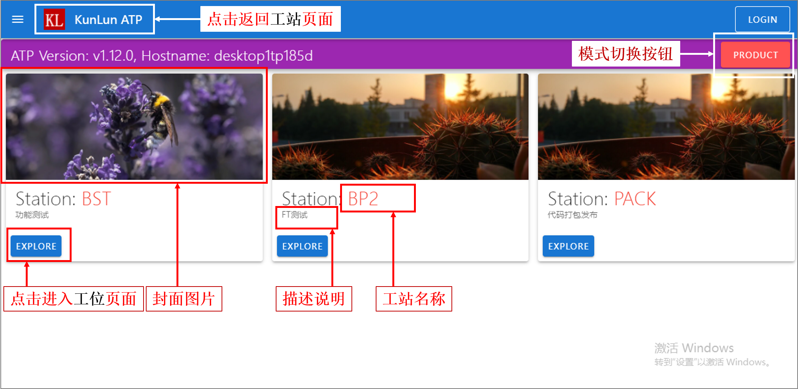
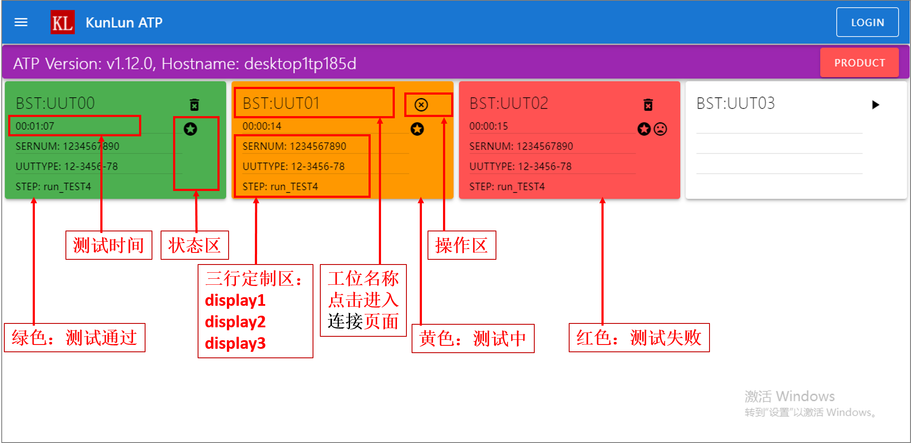
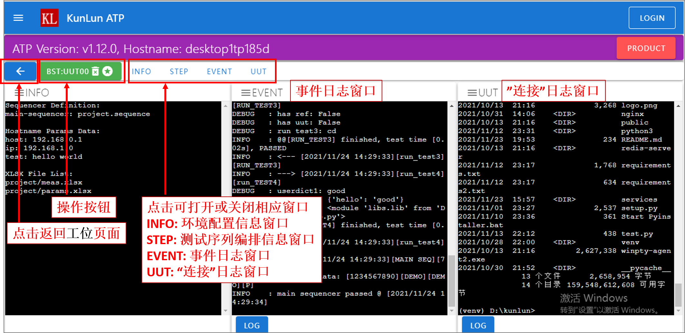

用户界面
============

本平台使用网页化的用户操作界面，用户可以通过网络远程连接，远程调试与协助。

**注意** ：随着平台版本升级，本文档内容可能存在滞后更新的情况，望理解。

Station测试工站界面
-------------------
Station测试工站，是用来分不同的测试任务集合。
例如不同产品采用不同的Station，或是同一产品的不同工站采用不同的Station.

Container测试工位界面
--------------------
Container测试工位，是执行具体测试任务主体，每个测试工位根据测试代码，
可以执行相同的测试任务，也可以执行不同的测试任务。

测试工位面板会以不同颜色代表不同的测试状态。

测试代码开发调试界面
------------------
测试代码开发调试界面，将会实时展示测试过程中产生的产品日志，事件日志。

测试数据查询下载界面
----------------
数据数据查询下载界面，可以查询历史测试记录，并下载与之关联的测试日志。

注意：可以使用接口函数 `lib.add_test_data()` 保存测试记录。

.. image:: ../_static/用户界面/data-search-2.png
.. image:: ../_static/用户界面/data-search-log.png
